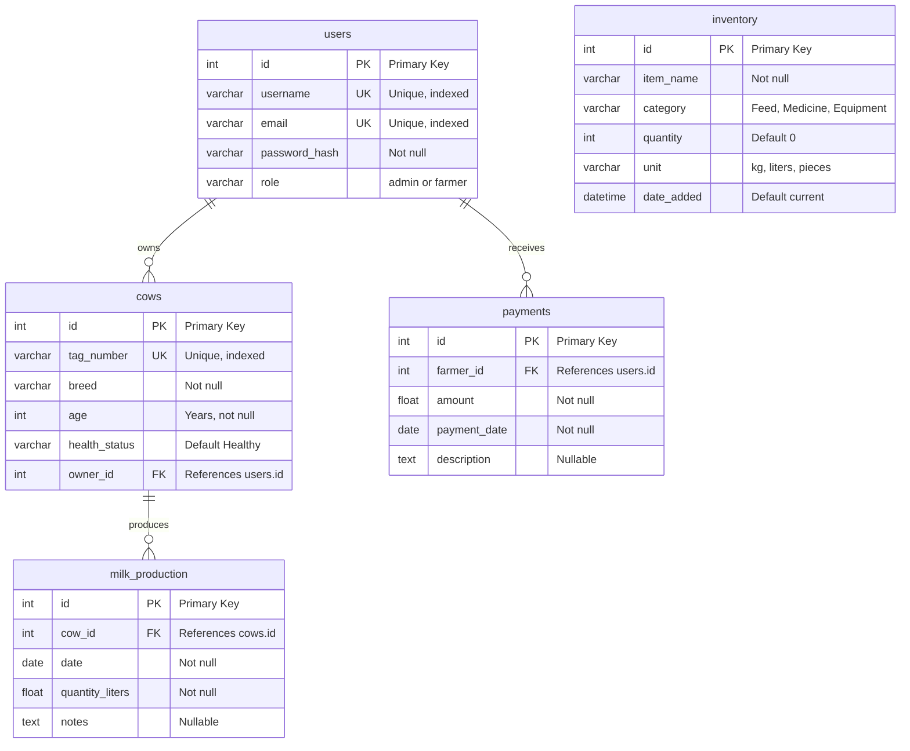

# Tabora AgriDairy — Database ERD

Entity-Relationship Diagram for the Tabora AgriDairy Management System (MySQL / SQLAlchemy).

---

## Mermaid ER Diagram

View this file in GitHub, VS Code (with Mermaid extension), or any Mermaid-compatible viewer.

---

## Relationship Summary

| From (Parent) | Relationship | To (Child)   | Cardinality | Description |
|---------------|-------------|--------------|-------------|-------------|
| **users**     | owns        | **cows**     | 1 : N       | One user (farmer/admin) can own many cows. |
| **cows**      | produces    | **milk_production** | 1 : N | One cow has many milk production records. |
| **users**     | receives    | **payments** | 1 : N       | One user (farmer) can have many payments. |
| **inventory** | —           | —            | —           | Standalone table; no FK to other entities. |

---

## Table Overview

| Table            | Purpose |
|------------------|--------|
| **users**        | User accounts (admin/farmer), authentication. |
| **cows**         | Livestock; each cow belongs to one user. |
| **milk_production** | Daily milk quantity per cow. |
| **inventory**    | Farm supplies (feed, medicine, equipment). |
| **payments**     | Payments to farmers (recorded by admin). |

---

## Indexes (from models)

- **users:** `username`, `email` (unique + index).
- **cows:** `tag_number` (unique + index), `owner_id` (FK).
- **milk_production:** composite index on `(cow_id, date)`.
- **inventory:** (no extra indexes).
- **payments:** `farmer_id` (FK).
